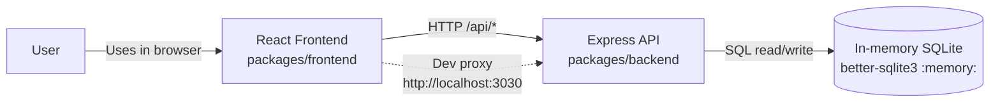
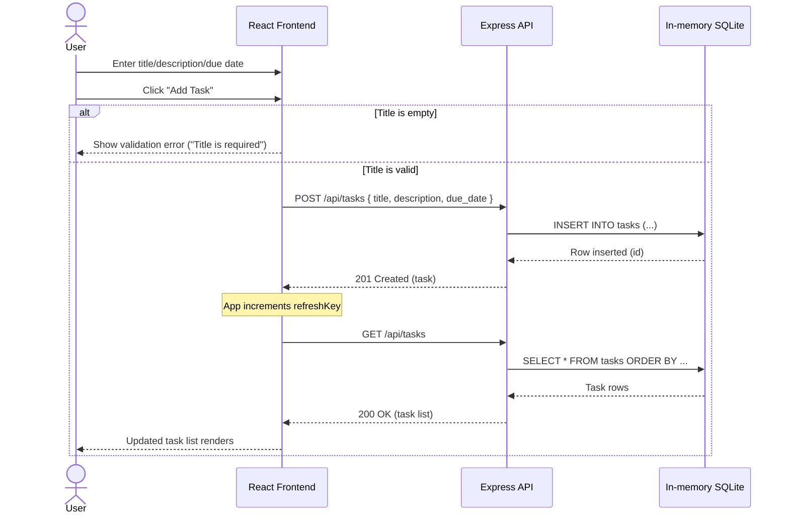

# Cloud Architecture Overview

This monorepo contains a React frontend that calls an Express API. The API stores task data in an in-memory SQLite database.

## System Context Diagram

## Sequence Diagram: User Creates a TODO

